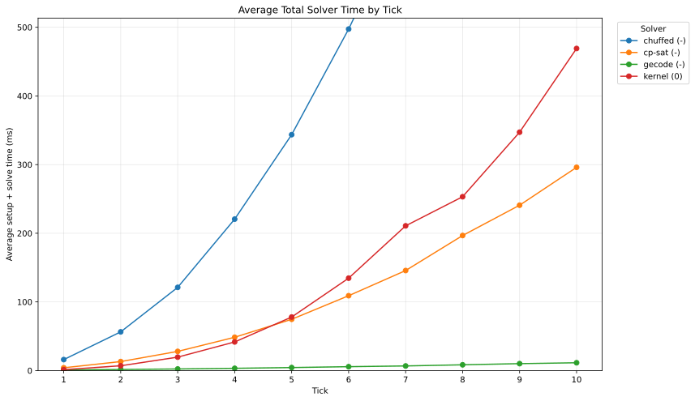

# Monotonic Chain Puzzle

The puzzle asks for a strictly increasing sequence of length `N` drawn from the domain `1..N`, i.e. `x[1] < x[2] < ... < x[N]`. There is no branching structure to speak of, so runtime is almost entirely a function of how efficiently a solver can rule out inconsistent values through arc consistency as it searches for support along a linear chain of N positions.

## Description

The puzzle is represented as `N` **nodes** of `N` **units** each: one node per chain position, one unit per candidate value `1..N`. The unit of propagation work is a **fact**, an assertion that unit `u` at node `n` needs to search either its **left** or **right** neighbouring node for support.

Under the **object** model, a fact is an object nest: an **atom** (a node/unit pair) wrapped together with a **link** value recording whether the search direction is left or right, i.e. `Object<Object<Node, Unit>, Link>`. 

Under the **scalar** model, that same triple is instead packed **row-major** into a single integer: `atom = node * unit_count + unit`, and `fact = atom * link_count + link`, so a fact collapses to one flat scalar rather than a chain of struct fields..

The field, queue, and cache components are each versioned independently. Earlier versions back their store with a **hash map**, either Rust's default DoS-resistant RandomState hasher (suffix `R`) or the faster, non-cryptographic FxHash (suffix `X`); later versions drop hashing entirely in favour of direct-indexed arrays or **bitsets**, since atoms and facts are already dense integers under the scalar encoding.

## Analysis

A `tick` controls the scale of the puzzle. The chain size is `N = 100 * tick`. For cross-module benchmarking, `N = 400` is used.

Mean reported in milliseconds. Standard deviation reported in % of the mean. 

The fastest module combination using:
- `scalar` is `V0` `F4  Q3M C4F` with **35** mean.
- `object` with non-secure hashing is `V0` `F3X Q1  C1X` with **54** mean.
- `object` with secure hashing is `V0` `F3X Q1  C1R` with **79** mean.

### Cross-Solver Benchmark

Reference using `minizinc` with [model.mzn](zinc/model.mzn) from [solver-bench.csv](solver-bench.csv):



| tick   | name      | v   |   st mean |   st stdv |   sv mean |   sv stdv |
|:-------|:----------|:----|----------:|----------:|----------:|----------:|
| `10`   | `gecode`  | `-` |         5 |       2.5 |         7 |       3.0 |
| `10`   | `cp-sat`  | `-` |         0 |       0.0 |       296 |       0.4 |
| `10`   | `kernel`  | `0` |        14 |       1.1 |       455 |       1.4 |
| `10`   | `chuffed` | `-` |      1342 |       0.7 |        62 |       3.0 |
| `9`    | `gecode`  | `-` |         5 |      14.7 |         5 |       6.5 |
| `9`    | `cp-sat`  | `-` |         0 |       0.0 |       241 |       0.3 |
| `9`    | `kernel`  | `0` |        12 |       5.3 |       336 |       0.9 |
| `9`    | `chuffed` | `-` |      1088 |       0.6 |        49 |       2.2 |
| `8`    | `gecode`  | `-` |         4 |       1.3 |         4 |       7.8 |
| `8`    | `cp-sat`  | `-` |         0 |       0.0 |       197 |       7.7 |
| `8`    | `kernel`  | `0` |        10 |       6.2 |       244 |       0.8 |
| `8`    | `chuffed` | `-` |       855 |       0.6 |        38 |       1.9 |
| `7`    | `gecode`  | `-` |         3 |       1.5 |         3 |       1.6 |
| `7`    | `cp-sat`  | `-` |         0 |       0.0 |       146 |       1.1 |
| `7`    | `kernel`  | `0` |         7 |       4.4 |       204 |       2.6 |
| `7`    | `chuffed` | `-` |       644 |       0.5 |        27 |       2.6 |
| `6`    | `gecode`  | `-` |         3 |       3.2 |         3 |       4.5 |
| `6`    | `cp-sat`  | `-` |         0 |       0.0 |       109 |       1.6 |
| `6`    | `kernel`  | `0` |         5 |       2.4 |       130 |       1.0 |
| `6`    | `chuffed` | `-` |       478 |       1.1 |        20 |       2.8 |
| `5`    | `gecode`  | `-` |         3 |       1.4 |         2 |       1.7 |
| `5`    | `cp-sat`  | `-` |         0 |       0.0 |        75 |       0.4 |
| `5`    | `kernel`  | `0` |         4 |       6.1 |        74 |       1.2 |
| `5`    | `chuffed` | `-` |       331 |       0.6 |        13 |       3.5 |
| `4`    | `gecode`  | `-` |         2 |       3.4 |         1 |       2.6 |
| `4`    | `kernel`  | `0` |         2 |       5.9 |        39 |       1.2 |
| `4`    | `cp-sat`  | `-` |         0 |       0.0 |        49 |       1.1 |
| `4`    | `chuffed` | `-` |       213 |       1.0 |         8 |       0.0 |
| `3`    | `gecode`  | `-` |         2 |       2.6 |         1 |       2.7 |
| `3`    | `kernel`  | `0` |         1 |      16.1 |        18 |       0.9 |
| `3`    | `cp-sat`  | `-` |         0 |       0.0 |        28 |       1.9 |
| `3`    | `chuffed` | `-` |       117 |       0.4 |         4 |       0.0 |
| `2`    | `gecode`  | `-` |         1 |       5.1 |         0 |      15.8 |
| `2`    | `kernel`  | `0` |         1 |       6.5 |         6 |       3.4 |
| `2`    | `cp-sat`  | `-` |         0 |       0.0 |        13 |       2.0 |
| `2`    | `chuffed` | `-` |        55 |       3.6 |         1 |      39.1 |
| `1`    | `gecode`  | `-` |         1 |       0.9 |         0 |       4.4 |
| `1`    | `kernel`  | `0` |         0 |       7.6 |         1 |       8.3 |
| `1`    | `cp-sat`  | `-` |         0 |       0.0 |         4 |       2.7 |
| `1`    | `chuffed` | `-` |        16 |       4.4 |         0 |       0.0 |

### Cross-Module Kernel Benchmark

Reference from [kernel-bench.csv](kernel-bench.csv):

| type     | name          | v   |   mean |   stdv |
|:---------|:--------------|:----|-------:|-------:|
| `scalar` | `F4  Q3M C4F` | `1` |     35 |    2.1 |
| `scalar` | `F4  Q3M C3 ` | `1` |     36 |    2.5 |
| `scalar` | `F5F Q3M C4F` | `1` |     37 |    1.7 |
| `scalar` | `F4  Q3M C4M` | `1` |     37 |    2.7 |
| `scalar` | `F3X Q1  C3 ` | `1` |     38 |    2.5 |
| `scalar` | `F3X Q1  C4F` | `1` |     38 |    4.4 |
| `scalar` | `F3X Q4F C3 ` | `1` |     38 |    1.7 |
| `scalar` | `F3X Q4F C4F` | `1` |     39 |    2.5 |
| `scalar` | `F3X Q1  C4M` | `1` |     39 |    2.7 |
| `scalar` | `F4  Q3M C2X` | `1` |     39 |    2.2 |
| `scalar` | `F3X Q4F C4M` | `1` |     39 |    1.7 |
| `scalar` | `F3X Q4M C3 ` | `1` |     39 |    3.6 |
| `scalar` | `F5F Q3M C3 ` | `1` |     39 |    3.6 |
| `scalar` | `F5F Q3M C4M` | `1` |     39 |    2.0 |
| `scalar` | `F3X Q4M C4F` | `1` |     40 |    1.8 |
| `scalar` | `F3X Q4M C4M` | `1` |     40 |    1.5 |
| `scalar` | `F5F Q3M C2X` | `1` |     41 |    3.1 |
| `scalar` | `F2X Q1  C3 ` | `1` |     41 |    2.1 |
| `scalar` | `F3X Q1  C2X` | `1` |     42 |    3.7 |
| `scalar` | `F2X Q1  C4F` | `1` |     42 |    2.3 |
| `scalar` | `F2X Q4F C4F` | `1` |     42 |    2.3 |
| `scalar` | `F2X Q4F C3 ` | `1` |     42 |    2.3 |
| `scalar` | `F2X Q1  C4M` | `1` |     42 |    2.5 |
| `scalar` | `F3X Q4F C2X` | `1` |     42 |    2.3 |
| `scalar` | `F2X Q4M C3 ` | `1` |     43 |    1.8 |
| `scalar` | `F2X Q4F C4M` | `1` |     43 |    2.5 |
| `scalar` | `F2X Q4M C4F` | `1` |     43 |    2.5 |
| `scalar` | `F3X Q4M C2X` | `1` |     43 |    2.4 |
| `scalar` | `F2X Q4M C4M` | `1` |     44 |    2.9 |
| `scalar` | `F3X Q1  C5F` | `1` |     44 |    6.9 |
| `scalar` | `F4  Q3M C5F` | `1` |     45 |    2.7 |
| `scalar` | `F4  Q3M C1X` | `1` |     45 |    2.4 |
| `scalar` | `F5F Q3M C5F` | `1` |     45 |    4.4 |
| `scalar` | `F2X Q1  C2X` | `1` |     45 |    1.8 |
| `scalar` | `F3X Q4F C5F` | `1` |     45 |    3.0 |
| `scalar` | `F4  Q3M C2R` | `1` |     46 |    3.5 |
| `scalar` | `F3X Q4M C5F` | `1` |     46 |    2.2 |
| `scalar` | `F3X Q1  C1X` | `1` |     46 |    2.2 |
| `scalar` | `F2X Q4F C2X` | `1` |     46 |    2.5 |
| `scalar` | `F3X Q2X C4F` | `1` |     46 |    2.2 |
| `scalar` | `F3X Q2X C3 ` | `1` |     46 |    2.8 |
| `scalar` | `F5F Q3M C1X` | `1` |     47 |    1.9 |
| `scalar` | `F2X Q4M C2X` | `1` |     47 |    1.9 |
| `scalar` | `F3X Q2X C4M` | `1` |     47 |    2.4 |
| `scalar` | `F3X Q4F C1X` | `1` |     47 |    1.7 |
| `scalar` | `F5F Q3M C2R` | `1` |     48 |    2.8 |
| `scalar` | `F3X Q4M C1X` | `1` |     48 |    1.5 |
| `scalar` | `F2X Q1  C5F` | `1` |     49 |    2.7 |
| `scalar` | `F3X Q1  C5M` | `1` |     49 |    3.8 |
| `scalar` | `F2X Q4F C5F` | `1` |     49 |    3.2 |
| `scalar` | `F2X Q4M C5F` | `1` |     49 |    2.4 |
| `scalar` | `F2X Q1  C1X` | `1` |     50 |    1.9 |
| `scalar` | `F2X Q2X C3 ` | `1` |     50 |    3.3 |
| `scalar` | `F3X Q4F C5M` | `1` |     50 |    3.1 |
| `scalar` | `F2X Q2X C4F` | `1` |     50 |    2.9 |
| `scalar` | `F3X Q2X C2X` | `1` |     51 |    2.9 |
| `scalar` | `F4  Q3M C5M` | `1` |     51 |    2.3 |
| `scalar` | `F3X Q4M C5M` | `1` |     51 |    1.8 |
| `scalar` | `F2X Q4F C1X` | `1` |     51 |    4.7 |
| `scalar` | `F2X Q2X C4M` | `1` |     51 |    2.6 |
| `scalar` | `F2X Q4M C1X` | `1` |     52 |    2.4 |
| `scalar` | `F5F Q3M C5M` | `1` |     53 |    1.8 |
| `scalar` | `F2X Q1  C5M` | `1` |     54 |    2.1 |
| `object` | `F3X Q1  C1X` | `0` |     54 |    3.5 |
| `scalar` | `F4  Q3M C1R` | `1` |     54 |    2.0 |
| `scalar` | `F2X Q4F C5M` | `1` |     54 |    2.0 |
| `scalar` | `F3X Q2X C5F` | `1` |     55 |    2.9 |
| `scalar` | `F2X Q4M C5M` | `1` |     55 |    2.0 |
| `scalar` | `F3X Q2R C3 ` | `1` |     55 |    2.3 |
| `scalar` | `F2X Q2X C2X` | `1` |     55 |    2.3 |
| `scalar` | `F3X Q2R C4F` | `1` |     56 |    2.1 |
| `scalar` | `F3X Q2X C1X` | `1` |     56 |    1.8 |
| `scalar` | `F5F Q3M C1R` | `1` |     56 |    2.9 |
| `scalar` | `F3X Q2R C4M` | `1` |     57 |    1.9 |
| `scalar` | `F3X Q1  C2R` | `1` |     57 |    1.7 |
| `scalar` | `F3X Q4F C2R` | `1` |     58 |    1.5 |
| `scalar` | `F2X Q2X C5F` | `1` |     58 |    2.5 |
| `scalar` | `F2X Q2R C3 ` | `1` |     59 |    2.2 |
| `object` | `F2X Q1  C1X` | `0` |     59 |    1.7 |
| `scalar` | `F2X Q2R C4F` | `1` |     59 |    2.2 |
| `scalar` | `F3X Q4M C2R` | `1` |     59 |    1.7 |
| `scalar` | `F2X Q2X C1X` | `1` |     60 |    2.5 |
| `scalar` | `F3X Q2X C5M` | `1` |     60 |    2.5 |
| `scalar` | `F2X Q2R C4M` | `1` |     61 |    2.6 |
| `scalar` | `F3X Q2R C2X` | `1` |     61 |    4.9 |
| `scalar` | `F2X Q1  C2R` | `1` |     61 |    2.1 |
| `scalar` | `F2X Q4F C2R` | `1` |     62 |    2.0 |
| `scalar` | `F2X Q4M C2R` | `1` |     63 |    2.1 |
| `scalar` | `F3X Q2R C5F` | `1` |     63 |    2.2 |
| `scalar` | `F2X Q2R C2X` | `1` |     64 |    2.5 |
| `scalar` | `F3X Q1  C1R` | `1` |     65 |    1.9 |
| `scalar` | `F2X Q2X C5M` | `1` |     66 |    3.8 |
| `scalar` | `F3X Q4F C1R` | `1` |     66 |    1.6 |
| `scalar` | `F3X Q2R C1X` | `1` |     67 |    2.7 |
| `scalar` | `F3X Q2X C2R` | `1` |     67 |    2.0 |
| `scalar` | `F2X Q2R C5F` | `1` |     67 |    3.1 |
| `scalar` | `F3X Q4M C1R` | `1` |     67 |    1.4 |
| `scalar` | `F3X Q2R C5M` | `1` |     68 |    1.9 |
| `scalar` | `F3R Q1  C4F` | `1` |     68 |    1.7 |
| `scalar` | `F2X Q1  C1R` | `1` |     69 |    1.3 |
| `scalar` | `F2X Q2R C1X` | `1` |     69 |    1.8 |
| `scalar` | `F3R Q1  C3 ` | `1` |     69 |    2.5 |
| `scalar` | `F3R Q1  C4M` | `1` |     69 |    2.1 |
| `scalar` | `F3R Q4F C4F` | `1` |     69 |    2.0 |
| `scalar` | `F3R Q4F C4M` | `1` |     70 |    1.8 |
| `scalar` | `F3R Q4F C3 ` | `1` |     70 |    2.1 |
| `scalar` | `F2X Q4F C1R` | `1` |     71 |    1.9 |
| `scalar` | `F3R Q4M C3 ` | `1` |     71 |    1.1 |
| `scalar` | `F2X Q2X C2R` | `1` |     71 |    2.3 |
| `scalar` | `F2X Q4M C1R` | `1` |     71 |    2.2 |
| `scalar` | `F3R Q4M C4F` | `1` |     72 |    1.6 |
| `scalar` | `F3R Q1  C5F` | `1` |     72 |    2.0 |
| `scalar` | `F3R Q4M C4M` | `1` |     73 |    2.2 |
| `scalar` | `F3R Q4F C5F` | `1` |     73 |    2.3 |
| `scalar` | `F3R Q1  C2X` | `1` |     73 |    1.9 |
| `scalar` | `F2X Q2R C5M` | `1` |     73 |    1.8 |
| `scalar` | `F3R Q4M C5F` | `1` |     74 |    1.6 |
| `scalar` | `F3R Q4F C2X` | `1` |     74 |    1.7 |
| `scalar` | `F3X Q2X C1R` | `1` |     76 |    2.1 |
| `scalar` | `F3R Q4M C2X` | `1` |     77 |    1.7 |
| `scalar` | `F3X Q2R C2R` | `1` |     77 |    3.4 |
| `scalar` | `F3R Q1  C1X` | `1` |     77 |    1.9 |
| `scalar` | `F3R Q3M C3 ` | `1` |     77 |    1.7 |
| `scalar` | `F3R Q4F C1X` | `1` |     78 |    1.8 |
| `scalar` | `F3R Q1  C5M` | `1` |     78 |    1.2 |
| `object` | `F3X Q1  C1R` | `0` |     79 |    8.7 |
| `scalar` | `F3R Q3M C4F` | `1` |     79 |    2.1 |
| `scalar` | `F3R Q2X C4F` | `1` |     79 |    2.7 |
| `scalar` | `F3R Q2X C3 ` | `1` |     79 |    1.8 |
| `scalar` | `F3R Q4F C5M` | `1` |     79 |    1.7 |
| `scalar` | `F3R Q2X C4M` | `1` |     79 |    3.0 |
| `scalar` | `F2X Q2X C1R` | `1` |     79 |    2.0 |
| `scalar` | `F2X Q2R C2R` | `1` |     80 |    2.2 |
| `scalar` | `F3R Q4M C1X` | `1` |     80 |    1.9 |
| `scalar` | `F3R Q4M C5M` | `1` |     81 |    2.3 |
| `scalar` | `F3R Q3M C4M` | `1` |     81 |    1.7 |
| `object` | `F2X Q1  C1R` | `0` |     82 |    2.6 |
| `scalar` | `F3R Q2X C5F` | `1` |     82 |    1.9 |
| `scalar` | `F2R Q1  C3 ` | `1` |     83 |    1.7 |
| `scalar` | `F2R Q4F C3 ` | `1` |     83 |    1.4 |
| `scalar` | `F2R Q1  C4M` | `1` |     84 |    1.5 |
| `scalar` | `F2R Q4F C4F` | `1` |     84 |    1.4 |
| `scalar` | `F3R Q3M C2X` | `1` |     84 |    1.4 |
| `scalar` | `F2R Q1  C4F` | `1` |     84 |    1.9 |
| `scalar` | `F3R Q3M C5F` | `1` |     84 |    2.1 |
| `scalar` | `F2R Q4F C4M` | `1` |     85 |    1.4 |
| `scalar` | `F3R Q2X C2X` | `1` |     85 |    2.1 |
| `scalar` | `F3X Q2R C1R` | `1` |     85 |    1.9 |
| `scalar` | `F2R Q4M C4F` | `1` |     86 |    1.4 |
| `object` | `F3R Q1  C1X` | `0` |     86 |    2.4 |
| `scalar` | `F2R Q4M C3 ` | `1` |     86 |    1.6 |
| `scalar` | `F5M Q3M C3 ` | `1` |     87 |    1.2 |
| `scalar` | `F2R Q1  C5F` | `1` |     87 |    1.6 |
| `scalar` | `F2R Q4M C4M` | `1` |     87 |    1.3 |
| `scalar` | `F3R Q2X C1X` | `1` |     87 |    1.8 |
| `scalar` | `F2R Q4F C5F` | `1` |     87 |    1.5 |
| `scalar` | `F3R Q3M C1X` | `1` |     88 |    2.3 |
| `scalar` | `F2X Q2R C1R` | `1` |     88 |    1.5 |
| `scalar` | `F2R Q1  C2X` | `1` |     88 |    1.7 |
| `scalar` | `F5M Q3M C4F` | `1` |     88 |    1.1 |
| `scalar` | `F5M Q3M C4M` | `1` |     88 |    1.2 |
| `scalar` | `F2R Q4M C5F` | `1` |     88 |    1.8 |
| `scalar` | `F3R Q2R C4F` | `1` |     88 |    1.6 |
| `scalar` | `F3R Q2R C3 ` | `1` |     89 |    2.1 |
| `scalar` | `F2R Q4F C2X` | `1` |     89 |    2.0 |
| `scalar` | `F3R Q2R C4M` | `1` |     89 |    2.0 |
| `scalar` | `F3R Q2X C5M` | `1` |     90 |    1.5 |
| `scalar` | `F2R Q4M C2X` | `1` |     91 |    1.4 |
| `scalar` | `F2R Q1  C1X` | `1` |     91 |    1.6 |
| `scalar` | `F5M Q3M C2X` | `1` |     92 |    1.0 |
| `scalar` | `F3R Q3M C5M` | `1` |     92 |    1.5 |
| `scalar` | `F2R Q4F C1X` | `1` |     92 |    1.9 |
| `scalar` | `F3R Q1  C2R` | `1` |     92 |    1.5 |
| `scalar` | `F3R Q2R C5F` | `1` |     92 |    1.7 |
| `scalar` | `F2R Q3M C4F` | `1` |     93 |    1.5 |
| `scalar` | `F2R Q2X C3 ` | `1` |     93 |    2.2 |
| `scalar` | `F2R Q2X C4F` | `1` |     93 |    1.6 |
| `scalar` | `F2R Q2X C4M` | `1` |     93 |    1.1 |
| `scalar` | `F3R Q4F C2R` | `1` |     93 |    2.2 |
| `scalar` | `F2R Q1  C5M` | `1` |     94 |    1.7 |
| `scalar` | `F2R Q4M C1X` | `1` |     94 |    1.2 |
| `scalar` | `F5M Q3M C5F` | `1` |     94 |    1.9 |
| `scalar` | `F2R Q3M C3 ` | `1` |     94 |    2.2 |
| `scalar` | `F3R Q2R C2X` | `1` |     95 |    2.1 |
| `scalar` | `F2R Q4F C5M` | `1` |     95 |    1.4 |
| `scalar` | `F3R Q4M C2R` | `1` |     95 |    1.9 |
| `scalar` | `F2R Q3M C4M` | `1` |     95 |    1.1 |
| `scalar` | `F2R Q4M C5M` | `1` |     96 |    1.6 |
| `scalar` | `F5M Q3M C2R` | `1` |     96 |    1.5 |
| `scalar` | `F2R Q2X C5F` | `1` |     97 |    1.6 |
| `scalar` | `F5M Q3M C1X` | `1` |     97 |    1.9 |
| `scalar` | `F3R Q2R C1X` | `1` |     97 |    1.6 |
| `scalar` | `F2R Q3M C5F` | `1` |     99 |    1.8 |
| `scalar` | `F3R Q1  C1R` | `1` |     99 |    1.9 |
| `scalar` | `F2R Q2X C2X` | `1` |     99 |    2.3 |
| `scalar` | `F2R Q3M C2X` | `1` |     99 |    1.3 |
| `scalar` | `F3R Q2R C5M` | `1` |    100 |    1.6 |
| `scalar` | `F3R Q4F C1R` | `1` |    101 |    1.3 |
| `scalar` | `F3R Q3M C2R` | `1` |    101 |    1.4 |
| `scalar` | `F2R Q2X C1X` | `1` |    101 |    1.9 |
| `scalar` | `F5M Q3M C5M` | `1` |    101 |    3.1 |
| `object` | `F2R Q1  C1X` | `0` |    102 |    1.7 |
| `scalar` | `F3R Q4M C1R` | `1` |    102 |    1.4 |
| `scalar` | `F2R Q2R C4F` | `1` |    102 |    1.8 |
| `scalar` | `F2R Q2R C4M` | `1` |    103 |    1.3 |
| `scalar` | `F3R Q2X C2R` | `1` |    103 |    1.8 |
| `scalar` | `F2R Q2R C3 ` | `1` |    103 |    2.3 |
| `scalar` | `F2R Q3M C1X` | `1` |    104 |    1.3 |
| `scalar` | `F2R Q1  C2R` | `1` |    106 |    0.7 |
| `scalar` | `F2R Q2X C5M` | `1` |    106 |    1.9 |
| `scalar` | `F2R Q2R C5F` | `1` |    107 |    1.1 |
| `scalar` | `F5M Q3M C1R` | `1` |    107 |    2.4 |
| `scalar` | `F2R Q3M C5M` | `1` |    107 |    1.8 |
| `scalar` | `F2R Q4F C2R` | `1` |    107 |    1.6 |
| `scalar` | `F3R Q3M C1R` | `1` |    108 |    1.2 |
| `scalar` | `F2R Q4M C2R` | `1` |    109 |    1.4 |
| `scalar` | `F2R Q2R C2X` | `1` |    109 |    1.7 |
| `scalar` | `F3R Q2X C1R` | `1` |    109 |    1.7 |
| `scalar` | `F3X Q3M C5F` | `1` |    111 |    1.1 |
| `scalar` | `F3R Q2R C2R` | `1` |    112 |    1.7 |
| `object` | `F3R Q1  C1R` | `0` |    113 |    6.8 |
| `scalar` | `F2R Q2R C1X` | `1` |    113 |    2.7 |
| `scalar` | `F3X Q3M C3 ` | `1` |    113 |    1.2 |
| `scalar` | `F2R Q1  C1R` | `1` |    113 |    1.3 |
| `scalar` | `F3X Q3M C4F` | `1` |    115 |    1.4 |
| `scalar` | `F2R Q2R C5M` | `1` |    115 |    1.2 |
| `scalar` | `F2R Q3M C2R` | `1` |    116 |    1.8 |
| `scalar` | `F2R Q4F C1R` | `1` |    116 |    1.4 |
| `scalar` | `F3X Q3M C4M` | `1` |    116 |    1.1 |
| `scalar` | `F2R Q4M C1R` | `1` |    117 |    1.3 |
| `scalar` | `F2R Q2X C2R` | `1` |    118 |    1.4 |
| `scalar` | `F2X Q3M C5F` | `1` |    119 |    1.7 |
| `scalar` | `F3R Q2R C1R` | `1` |    119 |    1.5 |
| `scalar` | `F2X Q3M C3 ` | `1` |    122 |    1.1 |
| `scalar` | `F3X Q3M C5M` | `1` |    122 |    1.5 |
| `scalar` | `F2X Q3M C4M` | `1` |    125 |    1.8 |
| `scalar` | `F2R Q3M C1R` | `1` |    125 |    1.0 |
| `scalar` | `F3X Q3M C2X` | `1` |    125 |    1.0 |
| `scalar` | `F2R Q2X C1R` | `1` |    125 |    1.9 |
| `scalar` | `F2R Q2R C2R` | `1` |    127 |    1.7 |
| `scalar` | `F2X Q3M C4F` | `1` |    127 |    1.8 |
| `scalar` | `F2X Q3M C5M` | `1` |    132 |    1.6 |
| `scalar` | `F3X Q3M C1X` | `1` |    133 |    0.7 |
| `object` | `F2R Q1  C1R` | `0` |    135 |    2.0 |
| `scalar` | `F2R Q2R C1R` | `1` |    135 |    1.7 |
| `scalar` | `F2X Q3M C2X` | `1` |    135 |    4.3 |
| `scalar` | `F2X Q3M C1X` | `1` |    142 |    1.6 |
| `scalar` | `F3X Q3M C2R` | `1` |    163 |    1.1 |
| `scalar` | `F3X Q3M C1R` | `1` |    175 |    0.9 |
| `scalar` | `F2X Q3M C2R` | `1` |    176 |    1.2 |
| `scalar` | `F2X Q3M C1R` | `1` |    184 |    0.7 |
| `scalar` | `F5F Q1  C5F` | `1` |    211 |    1.4 |
| `scalar` | `F5F Q1  C3 ` | `1` |    217 |    0.9 |
| `scalar` | `F1X Q3M C4F` | `1` |    219 |    0.9 |
| `scalar` | `F1X Q3M C4M` | `1` |    220 |    1.3 |
| `scalar` | `F1X Q3M C3 ` | `1` |    221 |    1.6 |
| `scalar` | `F5F Q1  C4F` | `1` |    224 |    1.5 |
| `scalar` | `F1X Q3M C2X` | `1` |    225 |    2.2 |
| `scalar` | `F1X Q3M C5F` | `1` |    226 |    1.0 |
| `scalar` | `F1X Q3M C2R` | `1` |    231 |    0.6 |
| `scalar` | `F5F Q4F C5F` | `1` |    231 |    1.9 |
| `scalar` | `F1X Q3M C5M` | `1` |    232 |    0.8 |
| `scalar` | `F1X Q3M C1X` | `1` |    232 |    0.8 |
| `scalar` | `F5F Q4F C3 ` | `1` |    233 |    1.6 |
| `scalar` | `F5F Q4M C5F` | `1` |    233 |    0.7 |
| `scalar` | `F5F Q4F C4F` | `1` |    239 |    1.3 |
| `scalar` | `F1X Q3M C1R` | `1` |    245 |    1.3 |
| `scalar` | `F5F Q1  C5M` | `1` |    245 |    1.1 |
| `scalar` | `F5F Q1  C4M` | `1` |    248 |    1.1 |
| `scalar` | `F4  Q1  C5F` | `1` |    251 |    0.4 |
| `scalar` | `F5F Q4M C4F` | `1` |    252 |    1.4 |
| `scalar` | `F5F Q4M C3 ` | `1` |    254 |    0.9 |
| `scalar` | `F5F Q4F C4M` | `1` |    255 |    0.8 |
| `scalar` | `F4  Q1  C3 ` | `1` |    259 |    2.2 |
| `scalar` | `F4  Q1  C4F` | `1` |    262 |    0.8 |
| `scalar` | `F5F Q4F C5M` | `1` |    263 |    0.7 |
| `scalar` | `F4  Q4F C5F` | `1` |    263 |    1.9 |
| `scalar` | `F4  Q4F C3 ` | `1` |    265 |    0.6 |
| `scalar` | `F4  Q4F C4F` | `1` |    266 |    1.0 |
| `scalar` | `F5F Q4M C4M` | `1` |    266 |    1.1 |
| `scalar` | `F4  Q1  C4M` | `1` |    267 |    0.5 |
| `scalar` | `F5F Q1  C2X` | `1` |    269 |    0.8 |
| `scalar` | `F4  Q4M C5F` | `1` |    270 |    1.6 |
| `scalar` | `F4  Q4M C3 ` | `1` |    272 |    0.8 |
| `scalar` | `F5F Q4M C5M` | `1` |    272 |    1.1 |
| `scalar` | `F4  Q1  C5M` | `1` |    275 |    1.0 |
| `scalar` | `F4  Q4F C4M` | `1` |    275 |    0.8 |
| `scalar` | `F4  Q4M C4F` | `1` |    278 |    0.4 |
| `scalar` | `F4  Q4F C5M` | `1` |    286 |    0.7 |
| `scalar` | `F5F Q4F C2X` | `1` |    287 |    0.9 |
| `scalar` | `F4  Q4M C4M` | `1` |    289 |    1.4 |
| `scalar` | `F4  Q1  C2X` | `1` |    292 |    0.6 |
| `scalar` | `F4  Q4M C5M` | `1` |    294 |    0.9 |
| `scalar` | `F5F Q4M C2X` | `1` |    303 |    1.3 |
| `scalar` | `F5F Q1  C1X` | `1` |    303 |    1.3 |
| `scalar` | `F4  Q4F C2X` | `1` |    306 |    1.2 |
| `scalar` | `F5M Q1  C5F` | `1` |    307 |    0.7 |
| `scalar` | `F4  Q2X C5F` | `1` |    309 |    1.7 |
| `scalar` | `F4  Q1  C1X` | `1` |    310 |    0.5 |
| `scalar` | `F5F Q2X C5F` | `1` |    310 |    1.0 |
| `scalar` | `F4  Q2X C3 ` | `1` |    311 |    1.5 |
| `scalar` | `F5F Q4F C1X` | `1` |    315 |    0.5 |
| `scalar` | `F4  Q4M C2X` | `1` |    316 |    1.0 |
| `scalar` | `F4  Q4F C1X` | `1` |    316 |    0.8 |
| `scalar` | `F4  Q2X C4M` | `1` |    320 |    0.5 |
| `scalar` | `F4  Q2X C4F` | `1` |    321 |    2.7 |
| `scalar` | `F5M Q4F C5F` | `1` |    323 |    0.7 |
| `scalar` | `F5F Q2X C3 ` | `1` |    324 |    2.9 |
| `scalar` | `F4  Q4M C1X` | `1` |    330 |    0.7 |
| `scalar` | `F5M Q1  C4F` | `1` |    330 |    0.6 |
| `scalar` | `F5M Q1  C3 ` | `1` |    331 |    1.2 |
| `scalar` | `F5F Q4M C1X` | `1` |    333 |    1.2 |
| `scalar` | `F5M Q4M C5F` | `1` |    333 |    1.2 |
| `object` | `F4  Q1  C1X` | `0` |    334 |    1.3 |
| `scalar` | `F4  Q2X C5M` | `1` |    334 |    1.0 |
| `scalar` | `F5F Q2X C4M` | `1` |    337 |    1.2 |
| `scalar` | `F5F Q2X C4F` | `1` |    337 |    2.2 |
| `scalar` | `F5M Q1  C4M` | `1` |    338 |    0.7 |
| `scalar` | `F5M Q4F C3 ` | `1` |    339 |    0.5 |
| `scalar` | `F5M Q4F C4F` | `1` |    341 |    0.7 |
| `scalar` | `F5M Q1  C5M` | `1` |    342 |    0.5 |
| `scalar` | `F5F Q2X C5M` | `1` |    347 |    1.6 |
| `scalar` | `F5M Q4M C3 ` | `1` |    350 |    0.6 |
| `scalar` | `F5M Q4F C5M` | `1` |    355 |    0.9 |
| `scalar` | `F4  Q2X C2X` | `1` |    357 |    0.7 |
| `scalar` | `F5M Q4M C4F` | `1` |    357 |    0.3 |
| `scalar` | `F5M Q4F C4M` | `1` |    358 |    0.9 |
| `scalar` | `F5M Q4M C5M` | `1` |    366 |    0.4 |
| `scalar` | `F5M Q4M C4M` | `1` |    368 |    1.1 |
| `scalar` | `F4  Q2X C1X` | `1` |    372 |    1.2 |
| `scalar` | `F5M Q1  C2X` | `1` |    378 |    0.9 |
| `scalar` | `F5M Q4F C2X` | `1` |    386 |    1.1 |
| `scalar` | `F5F Q2X C2X` | `1` |    393 |    2.8 |
| `scalar` | `F4  Q2R C5F` | `1` |    401 |    0.8 |
| `scalar` | `F5M Q4M C2X` | `1` |    405 |    0.8 |
| `scalar` | `F4  Q2R C4F` | `1` |    406 |    0.7 |
| `scalar` | `F4  Q2R C3 ` | `1` |    410 |    1.1 |
| `scalar` | `F4  Q2R C4M` | `1` |    414 |    0.5 |
| `scalar` | `F5M Q2X C5F` | `1` |    414 |    0.6 |
| `scalar` | `F4  Q2R C5M` | `1` |    419 |    0.2 |
| `scalar` | `F5M Q1  C1X` | `1` |    421 |    1.2 |
| `scalar` | `F5M Q4F C1X` | `1` |    433 |    1.0 |
| `scalar` | `F5M Q2X C3 ` | `1` |    434 |    1.7 |
| `scalar` | `F5F Q2X C1X` | `1` |    437 |    1.6 |
| `scalar` | `F5M Q2X C4F` | `1` |    439 |    1.0 |
| `scalar` | `F5M Q2X C5M` | `1` |    440 |    1.1 |
| `scalar` | `F5M Q4M C1X` | `1` |    447 |    0.6 |
| `scalar` | `F4  Q1  C2R` | `1` |    454 |    0.8 |
| `scalar` | `F5M Q2X C4M` | `1` |    455 |    2.8 |
| `scalar` | `F4  Q4F C2R` | `1` |    457 |    0.6 |
| `scalar` | `F4  Q2R C2X` | `1` |    461 |    1.8 |
| `scalar` | `F5F Q1  C2R` | `1` |    463 |    0.9 |
| `scalar` | `F5F Q2R C5F` | `1` |    465 |    1.1 |
| `scalar` | `F4  Q4M C2R` | `1` |    469 |    0.9 |
| `scalar` | `F4  Q2R C1X` | `1` |    471 |    0.8 |
| `scalar` | `F5F Q4F C2R` | `1` |    478 |    1.3 |
| `scalar` | `F4  Q1  C1R` | `1` |    482 |    0.8 |
| `scalar` | `F5F Q2R C3 ` | `1` |    483 |    0.4 |
| `scalar` | `F5F Q2R C4F` | `1` |    483 |    0.9 |
| `scalar` | `F5F Q4M C2R` | `1` |    494 |    1.1 |
| `scalar` | `F4  Q4F C1R` | `1` |    494 |    0.4 |
| `scalar` | `F5F Q2R C4M` | `1` |    496 |    1.4 |
| `scalar` | `F5F Q2R C5M` | `1` |    500 |    0.9 |
| `scalar` | `F4  Q4M C1R` | `1` |    503 |    0.7 |
| `scalar` | `F5M Q2X C2X` | `1` |    509 |    1.7 |
| `scalar` | `F4  Q2X C2R` | `1` |    510 |    0.6 |
| `scalar` | `F5F Q1  C1R` | `1` |    539 |    1.6 |
| `object` | `F4  Q1  C1R` | `0` |    541 |    1.3 |
| `scalar` | `F4  Q2X C1R` | `1` |    547 |    1.1 |
| `scalar` | `F5M Q2X C1X` | `1` |    550 |    1.5 |
| `scalar` | `F5F Q4F C1R` | `1` |    554 |    0.8 |
| `scalar` | `F5F Q4M C1R` | `1` |    566 |    1.0 |
| `scalar` | `F5M Q1  C2R` | `1` |    568 |    0.6 |
| `scalar` | `F5M Q2R C5F` | `1` |    573 |    0.6 |
| `scalar` | `F5F Q2R C2X` | `1` |    573 |    1.1 |
| `scalar` | `F5M Q4F C2R` | `1` |    579 |    0.9 |
| `scalar` | `F5M Q4M C2R` | `1` |    593 |    0.6 |
| `scalar` | `F4  Q2R C2R` | `1` |    595 |    0.5 |
| `scalar` | `F5M Q2R C3 ` | `1` |    598 |    0.7 |
| `scalar` | `F5M Q2R C4F` | `1` |    601 |    0.8 |
| `scalar` | `F5M Q2R C5M` | `1` |    602 |    0.1 |
| `scalar` | `F5F Q2R C1X` | `1` |    604 |    0.5 |
| `scalar` | `F5M Q2R C4M` | `1` |    609 |    0.6 |
| `scalar` | `F5F Q2X C2R` | `1` |    613 |    1.0 |
| `scalar` | `F5M Q1  C1R` | `1` |    639 |    0.3 |
| `scalar` | `F4  Q2R C1R` | `1` |    641 |    0.6 |
| `scalar` | `F5M Q4F C1R` | `1` |    658 |    0.8 |
| `scalar` | `F5M Q4M C1R` | `1` |    670 |    1.0 |
| `scalar` | `F5M Q2R C2X` | `1` |    689 |    1.0 |
| `scalar` | `F5F Q2X C1R` | `1` |    690 |    0.6 |
| `scalar` | `F5M Q2X C2R` | `1` |    703 |    0.6 |
| `scalar` | `F5M Q2R C1X` | `1` |    728 |    2.0 |
| `scalar` | `F5F Q2R C2R` | `1` |    776 |    1.0 |
| `scalar` | `F5M Q2X C1R` | `1` |    802 |    0.9 |
| `scalar` | `F1R Q3M C3 ` | `1` |    833 |    0.5 |
| `scalar` | `F1R Q3M C4M` | `1` |    834 |    0.6 |
| `scalar` | `F1R Q3M C5F` | `1` |    836 |    0.4 |
| `scalar` | `F1R Q3M C4F` | `1` |    838 |    1.3 |
| `scalar` | `F1R Q3M C2X` | `1` |    838 |    0.9 |
| `scalar` | `F1R Q3M C5M` | `1` |    845 |    0.2 |
| `scalar` | `F1R Q3M C2R` | `1` |    851 |    0.9 |
| `scalar` | `F5F Q2R C1R` | `1` |    857 |    0.8 |
| `scalar` | `F1R Q3M C1X` | `1` |    858 |    0.4 |
| `scalar` | `F1R Q3M C1R` | `1` |    868 |    0.9 |
| `scalar` | `F5M Q2R C2R` | `1` |    874 |    0.5 |
| `scalar` | `F5M Q2R C1R` | `1` |    970 |    0.6 |
| `scalar` | `F1X Q1  C3 ` | `1` |   1416 |    0.3 |
| `scalar` | `F1X Q1  C5F` | `1` |   1421 |    0.4 |
| `scalar` | `F1X Q1  C4F` | `1` |   1432 |    0.3 |
| `scalar` | `F1X Q4F C5F` | `1` |   1442 |    0.2 |
| `scalar` | `F1X Q4M C5F` | `1` |   1444 |    0.1 |
| `scalar` | `F1X Q4F C3 ` | `1` |   1449 |    0.3 |
| `scalar` | `F1X Q1  C4M` | `1` |   1452 |    0.6 |
| `scalar` | `F1X Q4F C4F` | `1` |   1453 |    0.8 |
| `scalar` | `F1X Q4M C4F` | `1` |   1456 |    0.7 |
| `scalar` | `F1X Q1  C5M` | `1` |   1457 |    0.5 |
| `scalar` | `F1X Q4M C3 ` | `1` |   1470 |    0.6 |
| `scalar` | `F1X Q4F C4M` | `1` |   1476 |    0.2 |
| `scalar` | `F1X Q4M C4M` | `1` |   1480 |    0.2 |
| `scalar` | `F1X Q4M C5M` | `1` |   1482 |    0.4 |
| `scalar` | `F1X Q4F C5M` | `1` |   1485 |    1.2 |
| `scalar` | `F1X Q4F C2X` | `1` |   1508 |    0.8 |
| `scalar` | `F1X Q1  C2X` | `1` |   1513 |    0.9 |
| `scalar` | `F1X Q4M C2X` | `1` |   1531 |    0.5 |
| `scalar` | `F1X Q1  C1X` | `1` |   1546 |    0.4 |
| `scalar` | `F1X Q2X C5F` | `1` |   1556 |    0.5 |
| `scalar` | `F1X Q4F C1X` | `1` |   1564 |    0.6 |
| `scalar` | `F1X Q4M C1X` | `1` |   1581 |    0.4 |
| `scalar` | `F1X Q2X C4F` | `1` |   1589 |    0.5 |
| `scalar` | `F1X Q2X C3 ` | `1` |   1592 |    1.2 |
| `scalar` | `F1X Q2X C4M` | `1` |   1594 |    0.3 |
| `scalar` | `F1X Q2X C5M` | `1` |   1611 |    0.7 |
| `scalar` | `F1X Q2X C2X` | `1` |   1653 |    0.8 |
| `scalar` | `F1X Q1  C2R` | `1` |   1699 |    0.4 |
| `scalar` | `F1X Q2X C1X` | `1` |   1708 |    0.5 |
| `scalar` | `F1X Q2R C5F` | `1` |   1714 |    0.2 |
| `scalar` | `F1X Q4F C2R` | `1` |   1727 |    0.6 |
| `scalar` | `F1X Q4M C2R` | `1` |   1731 |    0.3 |
| `scalar` | `F1X Q2R C3 ` | `1` |   1739 |    0.3 |
| `scalar` | `F1X Q2R C4F` | `1` |   1747 |    0.7 |
| `scalar` | `F1X Q2R C5M` | `1` |   1757 |    0.5 |
| `scalar` | `F1X Q2R C4M` | `1` |   1758 |    0.4 |
| `scalar` | `F1X Q1  C1R` | `1` |   1782 |    0.3 |
| `scalar` | `F1X Q4F C1R` | `1` |   1786 |    0.3 |
| `scalar` | `F1X Q4M C1R` | `1` |   1808 |    0.5 |
| `scalar` | `F1X Q2R C2X` | `1` |   1844 |    0.3 |
| `scalar` | `F1X Q2R C1X` | `1` |   1889 |    0.4 |
| `scalar` | `F1X Q2X C2R` | `1` |   1956 |    0.5 |
| `scalar` | `F1X Q2X C1R` | `1` |   1972 |    0.3 |
| `scalar` | `F1X Q2R C2R` | `1` |   2042 |    0.5 |
| `object` | `F1X Q1  C1X` | `0` |   2094 |    3.5 |
| `scalar` | `F1X Q2R C1R` | `1` |   2156 |    0.4 |
| `object` | `F1X Q1  C1R` | `0` |   2497 |    2.8 |
| `scalar` | `F1R Q4F C5F` | `1` |   5455 |    0.1 |
| `scalar` | `F1R Q4M C5F` | `1` |   5486 |    0.5 |
| `scalar` | `F1R Q4F C3 ` | `1` |   5492 |    0.1 |
| `scalar` | `F1R Q4F C4M` | `1` |   5505 |    0.4 |
| `scalar` | `F1R Q1  C5M` | `1` |   5507 |    0.3 |
| `scalar` | `F1R Q4F C5M` | `1` |   5520 |    0.2 |
| `scalar` | `F1R Q4M C3 ` | `1` |   5529 |    0.4 |
| `scalar` | `F1R Q4F C4F` | `1` |   5536 |    0.8 |
| `scalar` | `F1R Q4M C4M` | `1` |   5536 |    0.3 |
| `scalar` | `F1R Q4M C4F` | `1` |   5538 |    0.3 |
| `scalar` | `F1R Q4M C5M` | `1` |   5548 |    0.1 |
| `scalar` | `F1R Q1  C5F` | `1` |   5614 |    1.9 |
| `scalar` | `F1R Q1  C3 ` | `1` |   5631 |    0.6 |
| `scalar` | `F1R Q4F C2X` | `1` |   5641 |    0.1 |
| `scalar` | `F1R Q1  C4F` | `1` |   5668 |    1.5 |
| `scalar` | `F1R Q2X C5F` | `1` |   5678 |    0.7 |
| `scalar` | `F1R Q4M C2X` | `1` |   5683 |    0.2 |
| `scalar` | `F1R Q1  C2X` | `1` |   5688 |    0.7 |
| `scalar` | `F1R Q1  C4M` | `1` |   5701 |    0.5 |
| `scalar` | `F1R Q4F C1X` | `1` |   5716 |    0.4 |
| `scalar` | `F1R Q4M C1X` | `1` |   5717 |    0.5 |
| `scalar` | `F1R Q2X C5M` | `1` |   5728 |    0.3 |
| `scalar` | `F1R Q2X C3 ` | `1` |   5758 |    0.2 |
| `scalar` | `F1R Q2X C4F` | `1` |   5758 |    0.2 |
| `scalar` | `F1R Q2X C4M` | `1` |   5788 |    0.3 |
| `scalar` | `F1R Q1  C1X` | `1` |   5867 |    1.5 |
| `scalar` | `F1R Q2R C5F` | `1` |   5870 |    0.3 |
| `scalar` | `F1R Q2X C2X` | `1` |   5906 |    0.7 |
| `scalar` | `F1R Q4F C2R` | `1` |   5940 |    0.4 |
| `scalar` | `F1R Q4M C2R` | `1` |   5941 |    0.3 |
| `scalar` | `F1R Q2X C1X` | `1` |   5952 |    0.3 |
| `scalar` | `F1R Q2R C3 ` | `1` |   5967 |    0.5 |
| `scalar` | `F1R Q2R C4M` | `1` |   5992 |    0.7 |
| `scalar` | `F1R Q4F C1R` | `1` |   6023 |    0.3 |
| `scalar` | `F1R Q2R C4F` | `1` |   6035 |    1.4 |
| `scalar` | `F1R Q4M C1R` | `1` |   6050 |    0.3 |
| `scalar` | `F1R Q1  C2R` | `1` |   6083 |    1.3 |
| `scalar` | `F1R Q2R C5M` | `1` |   6095 |    2.3 |
| `scalar` | `F1R Q2R C2X` | `1` |   6132 |    0.3 |
| `scalar` | `F1R Q2R C1X` | `1` |   6178 |    0.3 |
| `scalar` | `F1R Q2X C1R` | `1` |   6269 |    0.3 |
| `scalar` | `F1R Q1  C1R` | `1` |   6291 |    0.4 |
| `scalar` | `F1R Q2R C2R` | `1` |   6393 |    0.4 |
| `scalar` | `F1R Q2X C2R` | `1` |   6413 |    3.2 |
| `scalar` | `F1R Q2R C1R` | `1` |   6463 |    0.4 |
| `object` | `F1R Q1  C1X` | `0` |   8927 |    0.7 |
| `object` | `F1R Q1  C1R` | `0` |   9256 |    1.7 |

### Microarchitecture Exploration

Performed using VTune on a machine with:
- 3.50 GHz i5-13600F CPU
- 3600 MHz DDR4 Memory

### kernel-0

```
Elapsed Time                           60.00s
Clockticks                    308,635,502,000
Instructions Retired        1,228,686,064,000
CPI Rate                                 0.3%
MUX Reliability                         93.7%

Retiring                                56.3%

Front-End Bound                         14.9%
  Front-End Latency                      4.8%
  Front-End Bandwidth                   10.1%

Bad Speculation                         12.9%
  Branch Mispredict                     11.7%

Back-End Bound                          15.9%
  Memory Bound                           9.7%
    L1 Bound                             2.8%
    L2 Bound                             1.2%
    L3 Bound                             0.7%
    DRAM Bound                           9.1%
    Store Bound                          0.4%
  Core Bound                             6.2%
    Divider                              0.0%
    Serializing Operations               2.7%
    Port Utilization                    18.6%

```

### gecode

```
Elapsed Time                           60.02s
Clockticks                    777,072,588,000
Instructions Retired        1,435,048,692,000
CPI Rate                                 0.5%
MUX Reliability                         98.4%

Retiring                                34.9%

Front-End Bound                         24.7%
  Front-End Latency                     13.4%
  Front-End Bandwidth                   11.3%

Bad Speculation                          5.4%
  Branch Mispredict                      6.6%

Back-End Bound                          35.0%
  Memory Bound                          16.8%
    L1 Bound                            15.4%
    L2 Bound                             0.9%
    L3 Bound                             2.4%
    DRAM Bound                           5.8%
    Store Bound                          0.5%
  Core Bound                            18.1%
    Divider                              0.4%
    Serializing Operations              22.8%
    Port Utilization                    19.7%

```

### chuffed

```
Elapsed Time                         59.99s
Clockticks                  304,907,404,000
Instructions Retired        684,436,166,000
CPI Rate                               0.4%
MUX Reliability                       99.3%

Retiring                              40.2%

Front-End Bound                       22.0%
  Front-End Latency                   10.3%
  Front-End Bandwidth                 11.7%

Bad Speculation                        7.6%
  Branch Mispredict                    4.2%

Back-End Bound                        30.2%
  Memory Bound                        19.7%
    L1 Bound                          16.3%
    L2 Bound                           0.0%
    L3 Bound                           1.7%
    DRAM Bound                        12.2%
    Store Bound                        1.5%
  Core Bound                          10.5%
    Divider                            0.2%
    Serializing Operations             5.6%
    Port Utilization                  20.4%

```

### cp-sat

```
Elapsed Time                         60.00s
Clockticks                  388,728,464,000
Instructions Retired        967,614,384,000
CPI Rate                               0.4%
MUX Reliability                       97.9%

Retiring                              50.0%

Front-End Bound                       35.3%
  Front-End Latency                   16.1%
  Front-End Bandwidth                 19.3%

Bad Speculation                        2.5%
  Branch Mispredict                    3.0%

Back-End Bound                        12.2%
  Memory Bound                         7.0%
    L1 Bound                          14.8%
    L2 Bound                           0.8%
    L3 Bound                           1.1%
    DRAM Bound                         3.9%
    Store Bound                        0.5%
  Core Bound                           5.2%
    Divider                            0.5%
    Serializing Operations             4.8%
    Port Utilization                  29.5%

```
